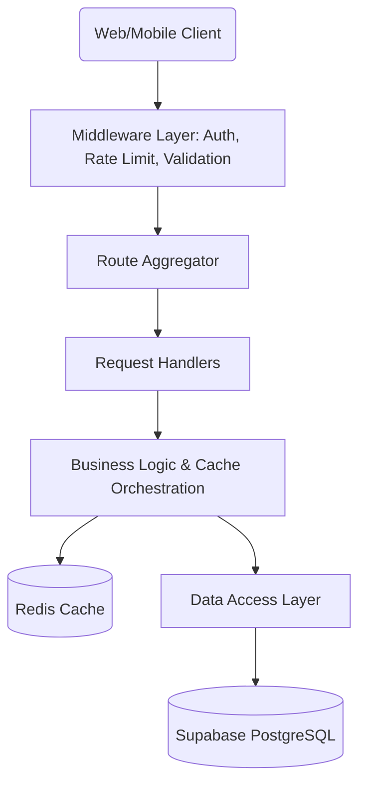

# 🌸 AnimeVerse API

<div align="center">
  <p align="center">
    <strong>A high-performance, feature-rich RESTful backend for the AnimeVerse ecosystem.</strong>
  </p>

  [](https://www.typescriptlang.org/)
  [](https://expressjs.com/)
  [](https://supabase.com/)
  [](https://redis.io/)
  [](https://opensource.org/licenses/ISC)

  <h4>
    <a href="#-overview">Overview</a> •
    <a href="#-getting-started">Getting Started</a> •
    <a href="#-api-reference">API Documentation</a> •
    <a href="#-architecture">Architecture</a>
  </h4>
</div>

---

## 🔥 Overview

**AnimeVerse API** is a robust backend solution designed for the AnimeVerse social platform. It provides a comprehensive set of features for anime enthusiasts to interact, share, and compete.

### ✨ Key Features
- **🛡️ Secure Authentication**: JWT-based auth via Supabase with automatic profile synchronization.
- **📚 Rich Data Models**: Deep integration for anime details, reactions, comments, and opinions.
- **⚡ Performance First**: Optional Redis caching layer for trending content and frequent queries.
- **⚔️ Interactive Systems**: Real-time anime battles, threaded discussions, and sentiment analysis.
- **🔔 Real-time Context**: Notification tracking for user interactions and platform updates.
- **�️ Quality Assurance**: Strict input validation, rate limiting, and structured global error handling.

---

## 🚀 Getting Started

### Prerequisites
- **Node.js** ≥ 18.x
- **npm** or **pnpm**
- **Supabase Account**: Required for Database and Auth.
- **Redis (Optional)**: Recommended for caching in production.

### Installation

```bash
# Clone the repository
git clone git@github.com:vkmnamit/anime_verse_backend.git
cd anime_verse_backend

# Install dependencies
npm install

# Setup environment
cp .env.example .env
# Edit .env with your credentials

# Run development server
npm run dev
```

### Scripts reference
| Command | Action |
| :--- | :--- |
| `npm run dev` | Starts server with `tsx` watch mode |
| `npm run build` | Compiles TypeScript to JavaScript in `/dist` |
| `npm run start` | Executes the production build |
| `npm run lint` | Runs type-checking without output |

---

## 🛠 Tech Stack

| Component | Technology |
| :--- | :--- |
| **Language** | [TypeScript](https://www.typescriptlang.org/) |
| **Framework** | [Express 5](https://expressjs.com/) |
| **Database** | [PostgreSQL (via Supabase)](https://supabase.com/) |
| **Auth** | [Supabase Auth (GoTrue)](https://supabase.com/auth) |
| **Caching** | [Redis](https://redis.io/) |
| **Env Management** | [dotenv](https://github.com/motdotla/dotenv) |

---

## 🔑 Configuration

The application requires specific environment variables to function. Create a `.env` file in the root directory.

| Variable | Type | Description |
| :--- | :--- | :--- |
| `PORT` | Number | Server port (Default: `4000`) |
| `SUPABASE_URL` | String | Your Supabase Project URL |
| `SUPABASE_ANON_KEY` | String | Public API key for Auth operations |
| `SUPABASE_SERVICE_KEY` | String | Secret key to bypass RLS for server-side operations |
| `REDIS_URL` | String | (Optional) Redis connection string |

---

## 📡 API Reference

Base URL: `http://localhost:4000/api/v1`

### 🔑 Authentication
Handles user registration, login, and session management.

| Method | Endpoint | Description |
| :--- | :--- | :--- |
| `POST` | `/auth/signup` | Create a new user account |
| `POST` | `/auth/login` | Authenticate and get JWT session |
| `POST` | `/auth/logout` | Terminate the current session |
| `GET` | `/auth/me` | Fetch authenticated user profile |

<details>
<summary><b>View Authentication Payloads</b></summary>

#### Login Request
```json
{
  "email": "user@example.com",
  "password": "secure_password"
}
```

#### Success Response (200 OK)
```json
{
  "success": true,
  "data": {
    "user": { "id": "uuid", "username": "otaku123", "email": "..." },
    "session": { "access_token": "jwt...", "refresh_token": "..." }
  }
}
```
</details>

---

### 📺 Anime Catalog
Endpoints for discovering and searching anime.

| Method | Endpoint | Description |
| :--- | :--- | :--- |
| `GET` | `/anime` | List anime with pagination & filters |
| `GET` | `/anime/search` | Full-text search by title |
| `GET` | `/anime/trending` | Top 20 trending anime (7-day activity) |
| `GET` | `/anime/popular` | Most popular anime of all time |
| `GET` | `/anime/:id` | Detailed view for a single anime |
| `GET` | `/anime/:id/sentiment` | AI-weighted sentiment analysis |

<details>
<summary><b>View Anime Query Parameters</b></summary>

| Parameter | Type | Default | Description |
| :--- | :--- | :--- | :--- |
| `page` | `number` | `1` | Results page offset |
| `limit` | `number` | `20` | Items per page (Max: 100) |
| `sort` | `string` | — | `popular` \| `score` \| `newest` |
| `genre` | `string` | — | Filter by specific genre |
</details>

---

### 💬 Social Interactions
Engage with the community through reactions, comments, and opinions.

#### 🎭 Reactions
| Method | Endpoint | Auth | Description |
| :--- | :--- | :--- | :--- |
| `POST` | `/reactions` | 🔑 | Add/Update reaction to an anime |
| `GET` | `/reactions/anime/:id` | ❌ | Get reaction counts for an anime |

#### 💬 Comments
| Method | Endpoint | Auth | Description |
| :--- | :--- | :--- | :--- |
| `POST` | `/comments` | 🔑 | Post a comment or reply |
| `GET` | `/comments/anime/:id` | ❌ | List threaded comments for an anime |
| `DELETE` | `/comments/:id` | 🔑 | Remove your own comment |

#### 📝 Opinions
| Method | Endpoint | Auth | Description |
| :--- | :--- | :--- | :--- |
| `POST` | `/opinions` | 🔑 | Share a short-form opinion |
| `POST` | `/opinions/:id/vote`| 🔑 | Upvote or downvote an opinion |

---

### ⚔️ Anime Battles
The arena where fans decide the superior titles.

| Method | Endpoint | Description |
| :--- | :--- | :--- |
| `GET` | `/battles` | List ongoing and past battles |
| `GET` | `/battles/:id` | View live vote results for a match |
| `POST` | `/battles/:id/vote` | Cast your vote for Side A or Side B |

---

### 📋 User Features
Manage individual watchlists and track personal activity.

| Method | Endpoint | Description |
| :--- | :--- | :--- |
| `GET` | `/watchlist` | Fetch your anime watchlist |
| `POST` | `/watchlist` | Add/Update status (Watching, Dropped, etc.) |
| `GET` | `/users/:username`| Public profile and activity statistics |
| `GET` | `/notifications` | Unread notifications feed |

---

## 🏗 Architecture

The system is built on a **Modular Layered Architecture**, ensuring high maintainability and testability.



### Components Responsibility
- **Controllers**: Handle HTTP semantics, input extraction, and response formatting.
- **Services**: Coordinate business logic, handle caching logic, and interact with multiple repositories.
- **Repositories**: Direct data manipulation and complex SQL queries.
- **Middleware**: Cross-cutting concerns like JWT verification and input sanitization.

---

## 🛡️ Best Practices & Features

### 📦 Standardized Responses
All responses return a uniform JSON envelope:
```json
{
  "success": true,
  "data": { ... },
  "meta": { "total": 100, "page": 1, "limit": 20 }
}
```

### 🚨 Structured Errors
Error handling is centralized. Never leaks stack traces to the client.
```json
{
  "success": false,
  "error": {
    "code": "unauthorized",
    "message": "Valid token required to access this resource"
  }
}
```

### ⏱️ Rate Limiting
Endpoints are protected by window-based rate limiting to prevent abuse.
- `60 requests / minute` for search/read operations.
- `20 requests / minute` for write operations (reactions, comments).

---

## 📂 Project Structure

```text
src/
├── config/       # Client factory patterns (DB, Redis)
├── controllers/  # Request/Response orchestration
├── routes/       # Endpoint definitions
├── services/     # Core business logic & Cache management
├── repositories/ # Optimized database queries
├── middlewares/  # Security, Auth, & Validation
├── utils/        # Shared constants & helpers
└── server.ts     # Bootstrap & App configuration
```

---

## 📄 License
Distributed under the **ISC License**. See `LICENSE` for more information.

<div align="center">
  <sub>Built with 🌸 by the AnimeVerse Team</sub>
</div>
