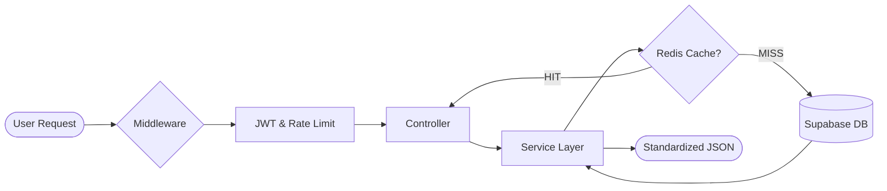

<]()
[](https://www.typescriptlang.org/)
[](https://nodejs.org/)
[](https://supabase.com/)

[🌍 Explore Live API (Production)]() • [📡 API Reference](./docs/API.md) • [🏗️ Architecture](#-architecture) • [🚀 Setup](#-setup)

</div>

---

## 🌟 Core Pillars

AnimeVerse API provides a high-performance RESTful interface for:

*   **⚡ Intelligence**: Real-time trending algorithms and sentiment analysis based on fan reactions.
*   **⚔️ Engagement**: Head-to-head anime battle engines with real-time community voting.
*   **💬 Social**: Robust threaded commenting and opinion systems with integrated auth.
*   **📋 Management**: Deep integration with Kitsu for watchlist synchronization and data enrichment.

---

## 🔧 Technology Stack

We use a modern, strictly-typed stack designed for speed and developer experience.

| Layer | Technology | Purpose |
| :--- | :--- | :--- |
| **Framework** | Express 5.x | High-performance routing & middleware |
| **Language** | TypeScript | Type safety across the request lifecycle |
| **Database** | PostgreSQL (Supabase) | Scalable relational storage & RLS |
| **Auth** | Supabase Auth | Secure JWT-based session management |
| **Caching** | Redis (ioredis) | Blazing fast responses for data-heavy routes |
| **Validation** | Custom Logic | Strict input sanitization & type checking |

---

## 🏗️ Architecture & Flow

The API follows a **Layered Service Architecture** to maintain clear separation of concerns.



- **Controller**: Manages HTTP semantics (status codes, headers).
- **Service**: Handles business logic (scoring, complex joins, caching logic).
- **Repository**: Encapsulates raw SQL/Supabase queries.
- **Middleware**: Global guards for security, validation, and analytics.

---

## 📂 Project Organization

```text
src/
├── app.ts            # Application setup & Middleware pipeline
├── server.ts         # Server entry point
├── config/           # Infrastructure clients (Supabase, Redis)
├── routes/           # REST endpoint definitions
├── controllers/      # Request orchestration
├── services/         # Core business logic & Cache management
├── repositories/     # Data access abstraction
├── middlewares/      # Security guards & Input validation
└── utils/            # Shared primitives (Response, Errors, Pagination)
```

---

## 🚀 Setup & Execution

### Quick Start

```bash
# Clone and install
git clone git@github.com:vkmnamit/anime_verse_backend.git
cd anime_verse_backend
npm install

# Environment Configuration
cp .env.example .env
# Edit .env with your Supabase credentials

# Launch
npm run dev
```

### Development Environment

- **Hot-Reloading**: Uses `tsx` for sub-second compilation on change.
- **Strict Linting**: TypeScript configuration enforces `noImplicitAny` and strict null checks.
- **Graceful Degradation**: The API remains functional even if Redis is unavailable.

---

## 📡 Essential Endpoints

See the [Full API Documentation](./docs/API.md) for detailed schemas and examples.

| Feature | Primary Endpoint | Status |
| :--- | :--- | :--- |
| **Anime** | `/api/v1/anime` | ✅ Stable |
| **Auth** | `/api/v1/auth` | ✅ Stable |
| **Battles** | `/api/v1/battles` | 🛠️ Beta |
| **Watchlist** | `/api/v1/watchlist` | ✅ Stable |
| **Social** | `/api/v1/comments` | ✅ Stable |

---

## 🛡️ Best Practices Implemented

- **Structured Error Handling**: Centralized `error.middleware.ts` for consistent error responses.
- **Standardized Responses**: All outputs wrap data in a predictable `{ success: true, data: { ... } }` structure.
- **Security First**: CORS enabled, helmet.js (recommended), and JWT-scoped permissions.
- **Performance**: Optional Redis integration for trending and details routes.

---

<div align="center">

**Built for the community, by the community.**

[AnimeVerse Github](https://github.com/vkmnamit)

</div>
]]>
